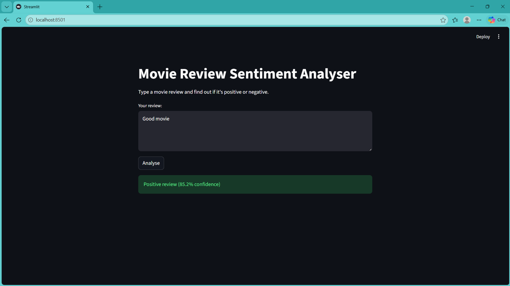
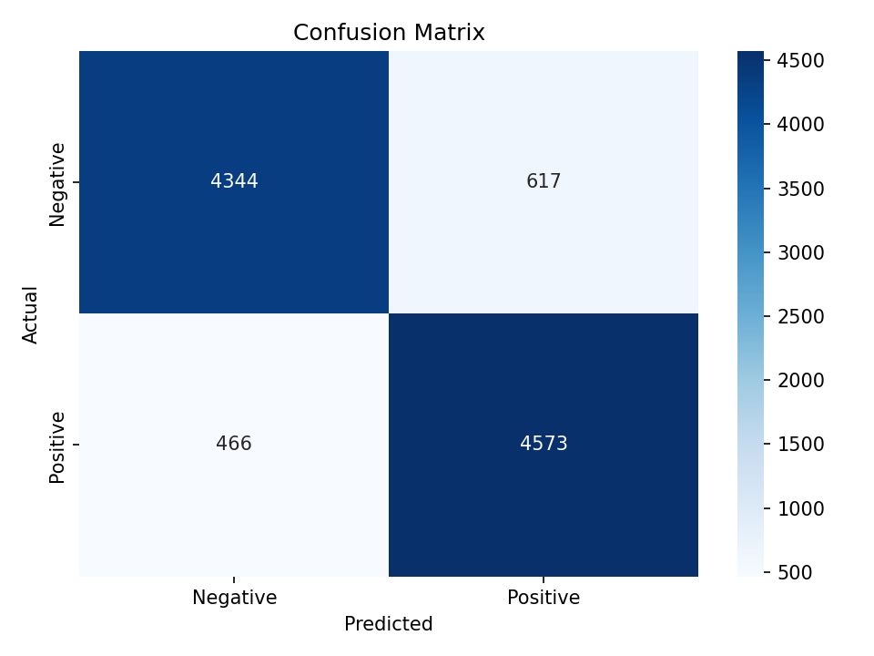

# 🎬 Movie Review Sentiment Analyser

A machine learning web app that predicts whether a movie review is **positive or negative** — trained on 50,000 IMDB reviews with **89% accuracy**.

Built with Python, scikit-learn, and Streamlit.

---

## 🚀 Live Demo

👉 **[Try the app here](https://sidharthmv9958-cpu-sentiment-analyzer-app-eevvsf.streamlit.app/)**



---

## 📌 Project Overview

This project builds a complete NLP pipeline from scratch:

- Loads and explores the IMDB 50K movie reviews dataset
- Cleans and preprocesses raw text (removes HTML, stopwords, punctuation)
- Converts text to numerical features using **TF-IDF vectorisation**
- Trains a **Logistic Regression** classifier
- Evaluates performance with accuracy, precision, recall, and F1-score
- Deploys as an interactive **Streamlit web app**

---

## 📊 Results

| Metric | Score |
|---|---|
| Accuracy | 89% |
| Precision (Positive) | 89% |
| Recall (Positive) | 89% |
| F1-Score | 89% |
| Training samples | 40,000 |
| Test samples | 10,000 |



---

## 🛠️ Tech Stack

| Tool | Purpose |
|---|---|
| Python 3.x | Core language |
| pandas | Data loading and manipulation |
| NLTK | Stopword removal, text preprocessing |
| scikit-learn | TF-IDF vectorisation, Logistic Regression, evaluation |
| matplotlib / seaborn | Confusion matrix visualisation |
| Streamlit | Web app deployment |
| joblib | Saving and loading the trained model |

---

## 📁 Project Structure

```
sentiment-analyser/
│
├── sentiment.py          # Full ML pipeline: load, clean, train, evaluate
├── app.py                # Streamlit web app
├── model.pkl             # Saved trained model
├── vectorizer.pkl        # Saved TF-IDF vectorizer
├── confusion_matrix.png  # Model evaluation chart
├── requirements.txt      # All dependencies
└── README.md             # This file
```

---

## ⚙️ How to Run Locally

**1. Clone the repository**
```bash
git clone https://github.com/sidharthmv9958-cpu/sentiment-analyser.git
cd sentiment-analyser
```

**2. Install dependencies**
```bash
pip install -r requirements.txt
```

**3. Download the dataset**

Download [IMDB Dataset.csv](https://www.kaggle.com/datasets/lakshmi25npathi/imdb-dataset-of-50k-movie-reviews) from Kaggle and place it in the project folder.

**4. Train the model**
```bash
python sentiment.py
```

**5. Run the web app**
```bash
streamlit run app.py
```

The app will open at `http://localhost:8501`

---

## 🧠 How It Works

```
Raw Review Text
      ↓
Clean Text (remove HTML, punctuation, stopwords, lowercase)
      ↓
TF-IDF Vectorisation (convert words → 10,000 numerical features)
      ↓
Logistic Regression Model (trained on 40,000 reviews)
      ↓
Prediction: Positive ✅ or Negative ❌ + Confidence %
```

---

## 📦 Requirements

Generate this file by running `pip freeze > requirements.txt`, or install manually:

```
pandas
scikit-learn
nltk
matplotlib
seaborn
streamlit
joblib
```

---

## 🔮 Future Improvements

- [ ] Try LSTM or BERT for higher accuracy
- [ ] Add support for other review platforms (Amazon, Rotten Tomatoes)
- [ ] Show the most influential words driving the prediction
- [ ] Add a confidence threshold to flag uncertain predictions

---

## 👤 Author

**Sidharth M V** — [GitHub](https://github.com/sidharthmv9958-cpu) · [LinkedIn](https://linkedin.com/in/sidharthmv9958)

---

## 📄 License

This project is open source under the [MIT License](LICENSE).
